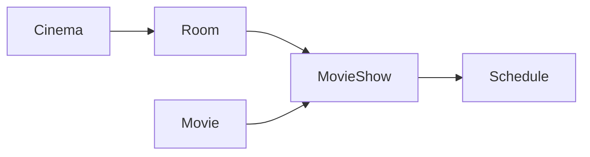

# Cinema Gestion

Application web de **programmation d’un groupe de cinémas** (projet CC-AIBD-08).  
Espace public (recherche de cinémas et de films, programme du jour, horaires) et espace administrateur (CRUD paginé avec recherche). Authentification JWT, refresh token et mot de passe oublié.

## Stack

| Couche | Technologies |
|--------|----------------|
| Backend | Spring Boot 3.5, Java 17, Spring Data JPA, Spring Security, JWT (JJWT), MapStruct, Springdoc OpenAPI |
| Frontend | Vite, React 19, React Router 7, Ant Design 6, dayjs |
| Base de données | PostgreSQL (dev) / H2 (tests) |
| Mail (dev) | SMTP local (MailHog, port 1025) |

## Prérequis

- JDK 17
- Maven (le wrapper `mvnw` / `mvnw.cmd` est fourni dans `cinema-gestion`)
- Node.js (npm)
- PostgreSQL, base `cinema`, utilisateur / mot de passe `cinema` (profil `dev`)
- Optionnel : MailHog sur `localhost:1025` pour les e-mails de réinitialisation de mot de passe

## Lancer le backend

```bash
cd cinema-gestion
./mvnw spring-boot:run
```

Sous Windows : `mvnw.cmd spring-boot:run`.

- Profil actif par défaut : **dev** (`application-dev.properties`)
- Port : **5151**
- Swagger UI : [http://localhost:5151/swagger-ui/index.html](http://localhost:5151/swagger-ui/index.html)
- OpenAPI JSON : [http://localhost:5151/v3/api-docs](http://localhost:5151/v3/api-docs)

## Lancer le frontend

```bash
cd frontend
npm install
npm run dev
```

- URL : [http://localhost:5173](http://localhost:5173)
- En développement, Vite proxy `/api` et `/auth` vers `http://localhost:5151` (`VITE_API_URL` vide). Voir [frontend/README.md](frontend/README.md).

## Modèle métier



- **Cinema** : nom, ville, rue, numéro ; possède des salles
- **Room** : capacité, date de construction ; appartient à un cinéma
- **Movie** : titre, date de sortie, genre
- **MovieShow** (séance) : film + salle + prix
- **Schedule** (horaire) : début / fin d’une séance

## Espaces fonctionnels

- **Public** (sans JWT) : liste des cinémas et films, programme du jour d’un cinéma, horaires d’un film
- **Auth** : inscription, connexion, refresh, déconnexion, mot de passe oublié / réinitialisation
- **Admin** (JWT) : CRUD paginé avec recherche sur cinémas, salles, films, séances et horaires

Endpoints admin (pattern commun) : `GET /find/{id}`, `GET /list/{page}/{size}?search=`, `POST /admin/create`, `PUT /admin/update/{id}`, `DELETE /admin/delete/{id}`  
Bases : `/api/cinema`, `/api/room`, `/api/movie`, `/api/movie-show`, `/api/schedule`.

## Structure du dépôt

```
cinema-gestion/     API Spring Boot (couches controller / service / repository / entity / dto / mapper)
frontend/           SPA React (api, auth, pages public/auth/admin, composants)
```

## Documentation du code

- **Javadoc** (backend) : commentaires dans `cinema-gestion/src/main/java`
- Générer le HTML Javadoc :

```bash
cd cinema-gestion
./mvnw javadoc:javadoc
```

Rapport : `cinema-gestion/target/site/javadoc/index.html`.

- **JSDoc** (frontend) : commentaires sur les modules et exports dans `frontend/src`
- **API HTTP** : Swagger UI (lien ci-dessus) et playbook `cinema-gestion/cinema-gestion.http`

## Tests backend

```bash
cd cinema-gestion
./mvnw test
```

Couverture Jacoco (seuil 50 %) et analyse SonarQube (`sonar-maven-plugin`) sont configurées dans `cinema-gestion/pom.xml`. Ne pas committer de token Sonar : passer `-Dsonar.token=...` en ligne de commande.
